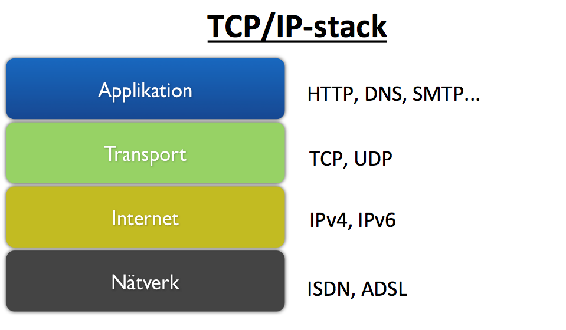

# HTTP - HyperText Transfer Protocol
This text is a short introduction to HTTP, the protocol that all web applications use and all web developers should know about. be sure to read the  external resources that are linked at the bottom of this document

HTTP is the protocol that clients and servers is using to understand the requests and responses. HTTP is a protocol, a set of rules, that is using the underlying Internet protocols. HTTP/www is a application running on the internet, just as e-mails (SMTP, POP3, IMAP) or file transfers applications (FTP).

In the underlaying layers of the Internet model we find protocols like IP (Internet protocol), TCP (Transmission Control Protocol) and DNS (Domain Name System). Through IP servers and clients can find and address each other. Through TCP they can connect and uphold a connection to each other. Through the DNS we can map domain names like www.lnu.se to ip-numbers as 194.47.110.233.

All this protocols är working together in different layers with HTTP on top to make HTTP requests and responses. Below is a image of the so called TCP/IP-modell that illustrates this.



### History
When Sir Tim Bernes-Lee created the application www, today known as "The web" http was one of the three pillars along with HTML end URL. The specification has been developed through the years but the latest specification HTTP 1.1 was presented in 1999 and is the specification we still use today. Think about it and think how the web applications looked back then and what how they look today. As we will see the old specifications have their problem in the demanding world of modern web development and a new specification is on its way (and in some sense already implemented.)

#### HTTP 0.9
This is a old version that is not in the use these days. It only support GET request, meaning you only could GET web pages don´t POST data from example a HTML form.

#### HTTP 1.0 and 1.1
These versions are still relevant today. Most of the HTTP traffic today is using the HTTP 1.1 version. Some features has been added and updated through the version here are some of them:

### The HTTP request
As you know the web is build through the server-client model, where the client sends request to the server that answers with responses. The part that sends the response is always the client. The HTTP protocol is used to get clients and servers to understand each other. This is done by sending text messages to each other that contains so called HTTP headers. A HTTP header is like a key-value pair that is specified in the specification and tells the other part what to do. Let´s see an example of a client request:

```
GET / HTTP 1.1
Host: www.lnu.se
Accept: text/html; application/xhtml+xml
User-Agent: Mozilla/5.0 (Macintosh; Intel Mac OS X 10_10_5) AppleWebKit/537.36 (KHTML, like Gecko) Chrome/47.0.2526.106 Safari/537.36
Accept-Encoding: gzip, deflate, sdch
Cookie: Ht31435329494053r0.36954162347629666
```
The first row tells the server that the clients wants to "GET" the root document "/" of the site and that the client is supporting the HTTP 1.1 version. The GET-word is called a HTTP method and tells the server what action the client want to do (hence sometimes called HTTP-action or HTTP-verb). The HTTP protocol defines different HTTP methods:

* GET (get a resource, could be a static resource or something like a search result - something doesn't change anything on the server, GET is a safe method)
* POST - Often in our web application we want to "post" data from a HTTP form. To tell the server that there are posted data with this request we can use the POST method. This could be used when we want to create something on the server say adding a message to a forum.

This is the two methods that is supported by HTML forms and the most common methods when creating classical web application but there are others.

* PUT - This method is similar to POST in that sense that it could be used to change resources on the server, create or modify something in a database for example. In most cases when you using PUT, as in a REST Web API, this means that the client want to update a existing resource. If the resource doesn't exists it should be created. PUT should there for include data with the request.

* DELETE - This method is used to tell the server to delete a resource, probably removing something from the database.

There are more methods like OPTIONS, HEAD and so on but for this time let stop with the above.

The second row is using the "Host"-header to tell the server what domain this called should be combined with. That is important so the sever, that could handle more then one domain, knows where to look after the requested resources.

The third row ("Accept") is a common header for a request where the client tells the server in what preferable format the answer should be sent. In this case it looks like the client want "text/html" that is the format for plain HTML documents. If the server could not provide this format it will look for the second format in the header that is "Application/xhtml+xml" that is the format for XHTML documents.

The forth row; User-Agent is a header that tells the server what kind of client that is making the request. In this case the request is from a web browser, Chrome on Mac. This header is not only used by browsers but also any kinds of clients as for example search engine spiders or web scrapers.

"Accept-Encoding" tells the server that the client has support for these three coding formats; gzip, deflate and sdch. These are compressing formats that allow the server to compress the data (the HTML document) it will send back. This is a feature that påtimize the amount of data that is send between the server and the client.

The last one in this example is the Cookie-header. A cookie is a way for the client (most times the web browser) to save information from the server and send along with every request. This is often used when a client has logged in to a web system and the server must know this state. The problem with this scenario is that HTTP and the web is stateless. That means that in its nature the web server get an request, do its thing, send the response and then disconnect the client and forget about the request. How should the server then know if a request is from a authenticated client? One common solution to this in web applications is using cookie, that identifies the client.


### The HTTP response
When the client sends a request with a HTTP method the server should answer with a status code that tells the client how the request went. This is done by a three digit number. There are five different groups of Status Codes:

* The 100-series
This status codes has to do with information the server is sending to client. The client should read it as "OK i got your request and is processing it". A common use is when a client is trying to make a Web Socket connection and the server answer with "101 Switching protocols".

* The 200-series
Every status code in this is some kind of "success" telling the client that the request went well. The most common is "200 OK" or the "201 Created"

* The 300-series
A code from this means that it should be a redirection. Maybe the resource is moved or that the server want the client to do a new request to another URL.

* The 400-series
This tells the client that something in its request was wrong. The problem is with the client and the server can´t figure out how to process the request.

* The 500-series
Something went wrong at the server. Maybe a bug in the web application or a bad connection to the database. The client could just wait for the server to fix this problem.

This is a example of how a server response could look like

```
HTTP/1.1 200 OK
Cache-Control: private, max-age=0
Date: Mon, 04 Jan 2016 10:16:16 GMT
Server: Apache-Coyote/1.1
Content-Type: text/html;charset=UTF-8
```

The first row tells what version of HTTP we´re using and that the request was successful with a 200 OK.

The Cache-Control header is telling the client (and all web proxies in between) that this resource should not be cached. A server can tell the client that a specific resource could be cached for a certain time to avoid the client to make unnecessary requests.

The Date-header is just a header telling the client when the response was created on the server.

The Server-header tells the client what kind of web server that made this response. In this case it looks like an Apche web server. Just as in the case of User-Agent is this something that is easy to spoof so don´t rely on this data.

The Content-Type tells the client in what format the response is. In this case its a plain HTML document (text/html) encoded in utf-8 format.

Of course there are a lot of more headers that are used in common HTTP traffic but its important as a web developer to understand how and why these are used.

## Further reading
This was just a short introduction to some of the key concepts. To get a deeper understanding of the web architecture and HTTP read these free articles:

http://code.tutsplus.com/series/http-succinctly--net-33683

These articles are taken from the book "HTTP Succinctly" which you can download as an pdf at [Syncfusion](https://www.syncfusion.com/resources/techportal/ebooks/http?utm_medium=BizDev-Nettutsplus0613) if you register an account. You don´t have to do this if you don´t want since the articles are the same as the book.
